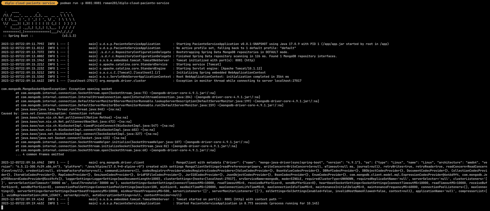

# Dillinger
## _The Last Markdown Editor, Ever_

[](https://nodesource.com/products/nsolid)

[](https://www.redhat.com/en/technologies/cloud-computing/openshift/get-started)

[](https://travis-ci.org/joemccann/dillinger)

Dillinger is a cloud-enabled, mobile-ready, offline-storage compatible,
AngularJS-powered HTML5 Markdown editor.

- Type some Markdown on the left
- See HTML in the right
- ✨Magic ✨

## Features

# Getting Started

## Project

Implementation of paciente microservice for the Safh application.
The paciente microservice provides the following functionalities:
- Registrar Paciente
- Obtener Todos los Pacientes
- Obtenr Paciente
- Eliminar Paciente
- 

The following scripts are provided for the MongoDB database/collections creation:
* pacientedb_creation.js


## Deploy

`// TODO `

### Maven, clean the project and then rebuilds it.
The result should look like this:

```
diplo-cloud-paciente-service  mvn clean package
[INFO] Scanning for projects...
[INFO]
[INFO] ----------------< unam.diplomado.safh:paciente-service >----------------
[INFO] Building paciente-service 0.0.1-SNAPSHOT
[INFO]   from pom.xml
[INFO] --------------------------------[ jar ]---------------------------------

[INFO] BUILD SUCCESS
[INFO] ------------------------------------------------------------------------
[INFO] Total time:  3.678 s
[INFO] Finished at: 2023-12-05T15:57:36-06:00
[INFO] ------------------------------------------------------------------------

```

### Building the image.

The image is based on [khipu/openjdk17](https://hub.docker.com/layers/khipu/openjdk17-alpine/latest/images/sha256-4dacc78eb744a6caf25ceae4eefa1f024455d62430c3a04fc2ccde320b7587d9?context=explore)

The complete specification of the image that contains the application is in the [Dockerfile](./Dockerfile)

### Building the image.

Build the image using `docker` or `podman`, below the commands for using `podman`. More information on how to use it [here](https://podman.io/). The first version for a standard is frequently used `1.0`.

> [!Warning]
> Don't forget to use your Hub's account to tag the image, because when pushing the image to the hub, the account is where it will be located. 

For build the image:

`podman build -t roman281/diplo-cloud-paciente-service .`

The result should look like this:


### Running the application

Run the application image into a container in `podman`, use the next command:


`podman run -p 8081:8081 roman281/diplo-cloud-paciente-service`

The expected output after the previous command looks like this:




### Publishing 

Publish the image in a __docker hub__ account using the next command. 

> [!Important]
> If you are not logged in to the hub, use the login command: `podman login docker.io -u {myuser}` then type the password.  

`podman push roman281/diplo-cloud-paciente-service`
 


### Tasks & Pipelines

This project use [Tekton](https://tekton.dev) as CI/CD tool. Common commands used for the automatism:

#### Git clone repository 

```bash
tkn task start git-clone \
--param=url=https://github.com/urielhdez/diplo-cloud-notificacion-service \
--param=deleteExisting="true" \
--workspace=name=output,claimName=shared-workspace \
--showlog
```

#### List directory

```bash
tkn task start list-directory \
--workspace=name=directory,claimName=shared-workspace \
--showlog
```

#### Build source code

```bash
tkn task start maven \
--param=GOALS="-B,-DskipTests,clean,package" \
--workspace=name=source,claimName=shared-workspace \
--workspace=name=maven-settings,config=maven-settings \
--showlog
```

> Para los proyectos Java que usen el JDK 17, recomendamos hacer uso de esta imagen maven que te permitirá llevar a cabo la compilación, tendrás que proporcionar el párametro `MAVEN_IMAGE` con el siguiente valor:
`gcr.io/cloud-builders/maven:3.6.3-openjdk-17@sha256:c74c4d8f7b470c2c47ba3fcb7e33ae2ebd19c3a85fc78d7b40c8c9a03f873312`

#### Build image

```bash
tkn task start buildah \
--param=IMAGE="docker.io/cafaray/notificaciones:v3" \
--param=TLSVERIFY="false" \
--workspace=name=source,claimName=shared-workspace \
--serviceaccount=tekton-pipeline \
--showlog
```

#### Deployment

```bash
tkn task start kubernetes-actions \
--param=script="kubectl apply -f https://raw.githubusercontent.com/brightzheng100/tekton-pipeline-example/master/manifests/deployment.yaml; kubectl get deployment;" \
--workspace=name=kubeconfig-dir,emptyDir=  \
--workspace=name=manifest-dir,emptyDir= \
--serviceaccount=tekton-pipeline \
--showlog
```

#### Integrated pipeline

```bash
tkn pipeline start pipeline-git-clone-build-push-deploy \
-s tekton-pipeline \
--param=repo-url=https://github.com/urielhdez/diplo-cloud-notificacion-service \
--param=tag-name=main \
--param=image-full-path-with-tag=docker.io/cafaray/
--param=deployment-manifest=https://raw.githubusercontent.com/brightzheng100/tekton-pipeline-example/master/manifests/deployment.yaml \
--workspace=name=workspace,claimName=shared-workspace \
--workspace=name=maven-settings,config=maven-settings \
--showlog
```

For more details in the use of [tekton](https://tekton.dev) in the project, visit [manifest section](./manifests/tekton.md).


## Test

Execute the next `curl` command to validate the deploy of the service. 

- Registrar Paciente

```shell
curl -X 'POST' \
  'http://localhost:8082/api/pacientes/registro' \
  -H 'accept: application/json' \
  -H 'Content-Type: application/json' \
  -d '{"paciente": {"nombre": "Prueba","telefonoCelular": "11-11-11-11","ultimoIngreso": "28/10/2016"},"domicilio": {"calle": "Olivo2","numExterior": "102","numInterior": "A202"}}'
```

The expected result should looks like:

```
{
  "id": "65260ea2c730a617f0b1aa28",
  "nombre": "Prueba",
  "telefonoCelular": "11-11-11-11",
  "ultimoIngreso": "28/10/2016",
  "domicilios": [
    {
      "calle": "Olivo2",
      "numExterior": "102",
      "numInterior": "A202"
    }
  ]
}
```

- Obtener Todos los Pacientes
```shell
curl -X 'GET' \
  'http://localhost:8082/api/pacientes' \
  -H 'accept: application/json'
```

The expected result should looks like:

```
[
  {
    "id": "652541dd6b50cf6125fa7426",
    "nombre": "Pedro",
    "telefonoCelular": "32-23-34-32",
    "ultimoIngreso": "28/10/2012",
    "domicilios": [
      {
        "calle": "Fresno",
        "numExterior": "107",
        "numInterior": "A201"
      }
    ]
  },
  {
    "id": "6525d9615fd1344e714d29d4",
    "nombre": "Luis",
    "telefonoCelular": "32-23-11-55",
    "ultimoIngreso": "28/10/2015",
    "domicilios": [
      {
        "calle": "Olivo",
        "numExterior": "107",
        "numInterior": "A201"
      }
    ]
  },
  {
    "id": "6525e76ac57b397430f6dab4",
    "nombre": "Paco",
    "telefonoCelular": "32-23-11-00",
    "ultimoIngreso": "28/10/2015",
    "domicilios": [
      {
        "calle": "Olivo",
        "numExterior": "107",
        "numInterior": "A201"
      }
    ]
  },
  {
    "id": "65260ea2c730a617f0b1aa28",
    "nombre": "Prueba",
    "telefonoCelular": "11-11-11-11",
    "ultimoIngreso": "28/10/2016",
    "domicilios": [
      {
        "calle": "Olivo2",
        "numExterior": "102",
        "numInterior": "A202"
      }
    ]
  }
]
```

- Obtenr Paciente
```shell
curl -X 'GET' \
  'http://localhost:8082/api/pacientes/65260ea2c730a617f0b1aa28' \
  -H 'accept: application/json'
```

The expected result should looks like:

```
{
  "id": "65260ea2c730a617f0b1aa28",
  "nombre": "Prueba",
  "telefonoCelular": "11-11-11-11",
  "ultimoIngreso": "28/10/2016",
  "domicilios": [
    {
      "calle": "Olivo2",
      "numExterior": "102",
      "numInterior": "A202"
    }
  ]
}

Response head
```

- Eliminar Paciente
```shell
curl -X 'DELETE' \
  'http://localhost:8082/api/pacientes/65260ea2c730a617f0b1aa28' \
  -H 'accept: application/json'
```

The expected result should looks like:

```
204

 connection: keep-alive  date: Wed,11 Oct 2023 03:05:07 GMT  keep-alive: timeout=60  vary: Origin,Access-Control-Request-Method,Access-Control-Request-Headers 
Response head
```


### Reference Documentation
For further reference, please consider the following sections:

* [Official Apache Maven documentation](https://maven.apache.org/guides/index.html)
* [Spring Boot Maven Plugin Reference Guide](https://docs.spring.io/spring-boot/docs/2.7.15/maven-plugin/reference/html/)
* [Create an OCI image](https://docs.spring.io/spring-boot/docs/2.7.15/maven-plugin/reference/html/#build-image)
* [Spring Web](https://docs.spring.io/spring-boot/docs/2.7.15/reference/htmlsingle/index.html#web)
* [Spring Data MongoDB](https://docs.spring.io/spring-boot/docs/2.7.15/reference/htmlsingle/index.html#data.nosql.mongodb)

### Guides
The following guides illustrate how to use some features concretely:

* [Building a RESTful Web Service](https://spring.io/guides/gs/rest-service/)
* [Serving Web Content with Spring MVC](https://spring.io/guides/gs/serving-web-content/)
* [Building REST services with Spring](https://spring.io/guides/tutorials/rest/)
* [Accessing Data with MongoDB](https://spring.io/guides/gs/accessing-data-mongodb/)

